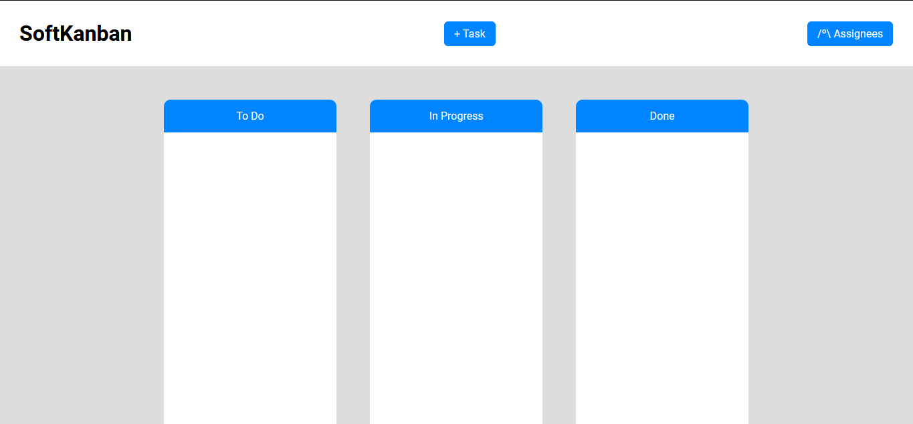

# MyKanban

A kanban chart made with a .NET API to store and manage tasks with a database, and its front-end made with HTML, CSS and JavaScript based on a YouTube DIY playlist by [Joel Maia](https://www.youtube.com/playlist?list=PLetAOIdBWDPc4hBaMTQ3On1oiQuBZXqd6) 

### Screenshot

### Stack

**Front-end:** Pure JavaScript

**Back-end:** Node, Express, ASP.NET

### Developers

- [@marianafelix](https://www.github.com/mari-felix)

